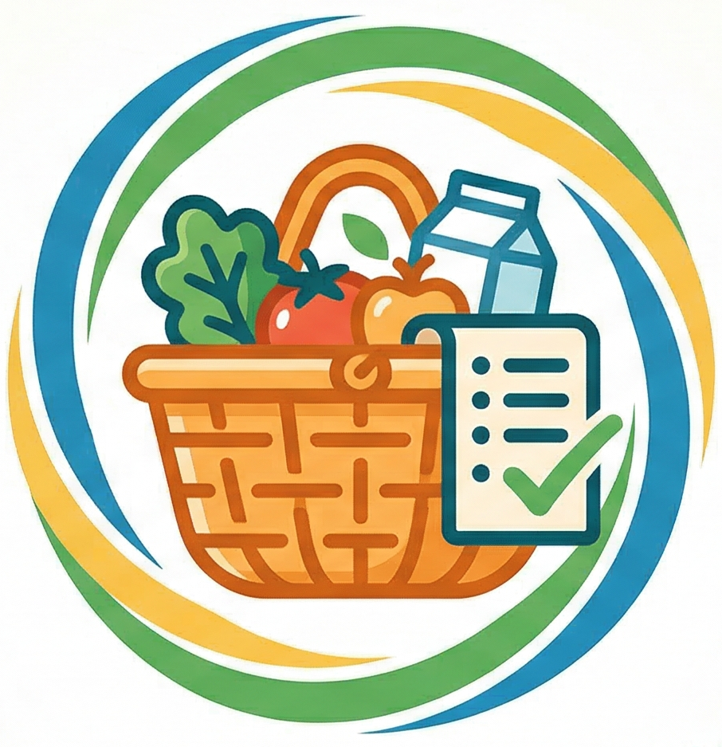

# 🛒 CanastaList - Tu Lista de Compras Inteligente y Colaborativa

**CanastaList** es la solución definitiva para gestionar las compras del hogar en equipo. Olvídate de los mensajes olvidados o de comprar dos veces lo mismo. Con CanastaList, tú y tu familia pueden mantener una lista de compras única, actualizada al segundo y accesible desde cualquier lugar.

---

## ✨ ¿Por qué usar CanastaList?

Imagina que estás en el supermercado y alguien en casa recuerda que falta leche. Con CanastaList, en cuanto lo anotan en su teléfono, **aparece mágicamente en el tuyo**. Así de fácil.

### 🌟 Funciones Principales:
*   **🤝 Grupos Familiares:** Crea un grupo compartido y permite que todos los miembros añadan o marquen productos.
*   **🔄 Sincronización Real:** Todo lo que hagas se refleja instantáneamente en los dispositivos de tu grupo.
*   **📶 Funciona sin Internet:** ¿No tienes señal en el súper? No hay problema. La app guarda tus cambios y los sincroniza automáticamente en cuanto recuperas la conexión.
*   **⏰ Recordatorios Inteligentes:** Programa una fecha y hora para productos específicos y la app te avisará para que no los olvides.
*   **👤 ¿Quién lo pidió?:** Cada producto muestra el nombre de la persona que lo añadió, para que sepas exactamente a quién preguntarle detalles.
*   **🎨 Diseño Moderno y Limpio:** Una interfaz visualmente atractiva, fácil de leer y diseñada para ser usada con una sola mano.

---

## 🚀 Cómo empezar en 3 pasos

1.  **Crea tu Perfil:** Solo dinos cómo quieres que te llamen en la lista (ej: "Papá", "Ana").
2.  **Crea o Únete a un Grupo:** Genera un código único y compártelo con tu familia, o introduce el código que ellos te den.
3.  **¡Empieza a Comprar!:** Añade productos, marca los que ya tienes y deja que la app se encargue del resto.

---

## 🛠️ Detalles Técnicos (Para Curiosos)

Para los entusiastas de la tecnología, CanastaList ha sido construida con los estándares más altos de la industria móvil actual:

*   **Lenguaje:** Kotlin (100% Nativo).
*   **Interfaz:** Jetpack Compose & Material 3 (Lo último en diseño para Android).
*   **Base de Datos Local:** Room (Para que nunca pierdas tus datos).
*   **Sincronización en la Nube:** Firebase Firestore (Tiempo real y escalabilidad).
*   **Arquitectura:** MVVM (Model-View-ViewModel) para un código limpio y fácil de mantener.
*   **Notificaciones:** Sistema de alarmas nativo de Android.

---

## 🔒 Privacidad y Seguridad

CanastaList utiliza un sistema de inicio de sesión anónimo y seguro. Tus datos de grupo están protegidos y solo son accesibles para aquellos que tengan el código de invitación único.

---

## 👨‍💻 Desarrollado por
**[Tu Nombre/BRAYANEXE]**
*Enfocado en crear soluciones móviles que faciliten el día a día.*

---
> *Este proyecto forma parte de mi portafolio profesional como Desarrollador Android Senior.*
